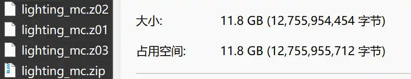
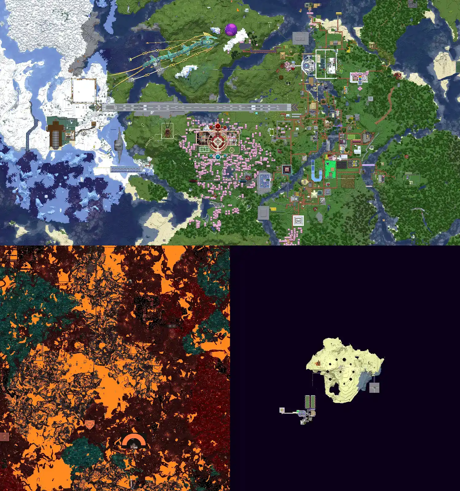

## 1. 下载存档
在灵动MC的QQ群里，可以获取到存档的下载方式（磁力链接、百度网盘等）。存档由 **四个压缩包** 组成，这是**分卷压缩**，所以必须全部下载。


主文件名是 `lighting_mc.zip`。

如果还没有解压软件，推荐使用 **[NanaZip](https://github.com/M2Team/NanaZip)**，这是 7zip 的一个分支，界面更友好、免费无广告。


## 2. 解压文件
解压 `lighting_mc.zip` 后，可以看到如下文件夹结构：

```

lighting_mc\
├─ world\
├─ world_nether\
└─ world_the_end\

```


## 3. 找到 Minecraft 存档目录
打开你的 Minecraft 安装目录，路径大致如下：

```

...\minecraft\versions\<版本号>\saves

```

> 这里的 `<版本号>` 代表你使用的 MC 版本。  
灵动MC最后的版本是 **1.20.6**，但使用高于这个版本（如 1.21.8）一般也没问题。


## 4. 创建新存档文件夹
在 `saves` 文件夹中，新建一个文件夹，例如：

```

...\saves\LDMC

```

文件夹名可以随意，但建议简短好记。


## 5. 拷贝存档数据
- 将 `world\` 文件夹里面的**所有内容**复制到 `LDMC\` 根目录。
- 将 `world_nether\` 里面的 `DIM-1\` 文件夹复制到 `LDMC\` 根目录。
- 将 `world_the_end` 里面的 `\DIM1\` 文件夹复制到 `LDMC\` 根目录。

如果你只需要主世界，可以不复制下界和末地。

最终 `LDMC` 文件夹的结构应该类似这样：

```

LDMC
├── advancements
├── data
├── datapacks
├── DIM-1
├── DIM1
├── entities
├── generated
├── playerdata
├── poi
├── region
├── stats
├── level.dat
├── level.dat.bk
├── level.dat\_old
├── paper-world.yml
├── session.lock
└── uid.dat

```


## 6. 进入游戏
1. 启动你选择的 Minecraft 版本。  
2. 进入 **单人模式**，你会看到一个世界名字是 **World**，灰色小字是 **LDMC**（刚才创建的文件夹名）。  
3. 进入即可看到灵动MC的世界，主世界、下界、末地都已正确导入。

> ⚠️ **注意**：第一次打开迁移后的存档时，游戏可能会非常卡顿、长时间未响应，这是正常现象，请耐心等待。  




## 7. 开启权限
进入世界后，按下 **`ESC` → `对局域网开放`**
- 游戏模式：创造  
- 允许命令：开  

点击“对局域网开放”后，你就拥有管理员权限，可以使用 **F3+F4** 随意切换游戏模式。


## 参考资料
- [PaperMC 官方迁移文档](https://docs.papermc.io/paper/migration/#migrating-from-paper)
- [灵动MC 官方网站](https://minecraft.neboer.site/)


*本文部分内容由 GPT-5 辅助生成与整理。*